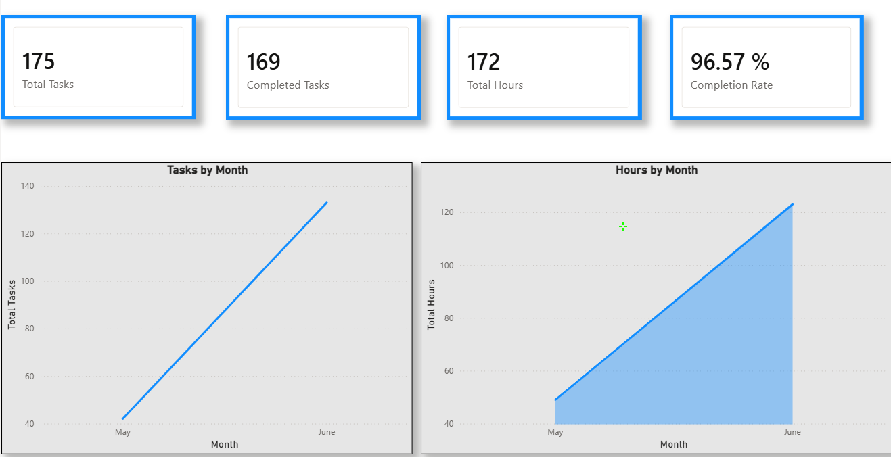
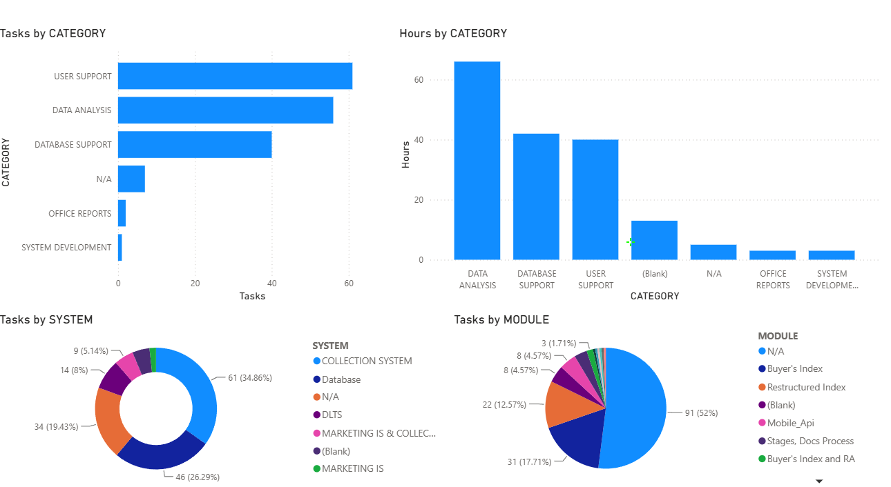
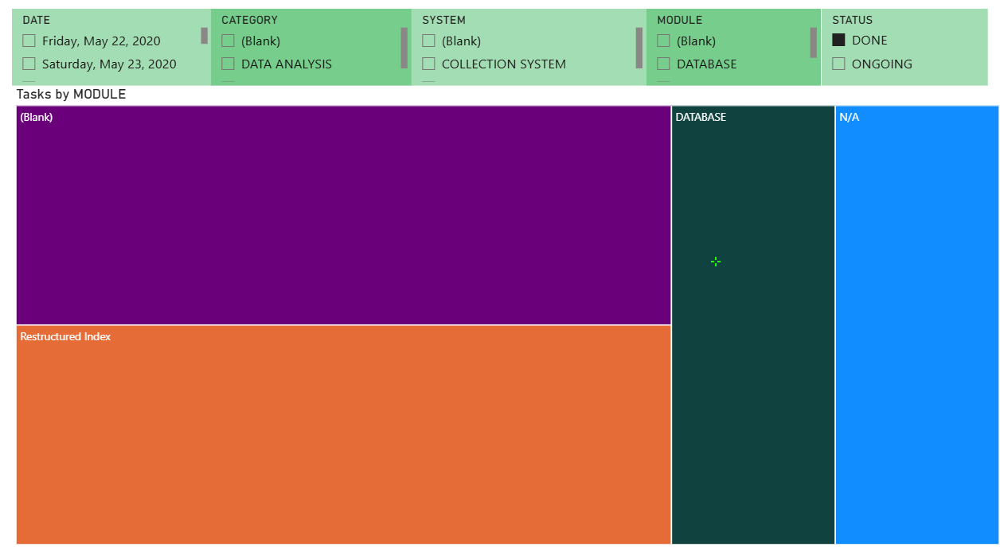
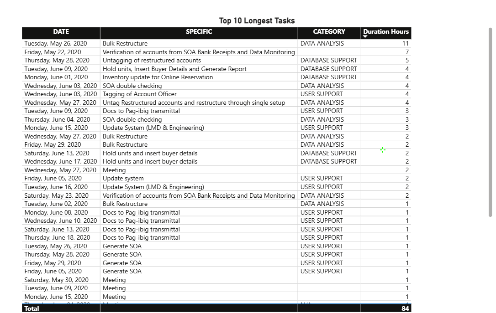

# ITDAR Productivity Dashboard

## Project Overview

This Power BI dashboard analyzes productivity performance, working hours, and module efficiency through interactive visualizations and KPI reporting.

## Tools Used

- Power BI
- Power Query
- DAX
- Data Modeling

## Dashboard Pages

### Executive Summary

### Working Analysis

### Module Analysis

### Insight Page

## Repository Structure

Dashboard/
Images/
Documentation/

## Author

Jeian Sumagpao
